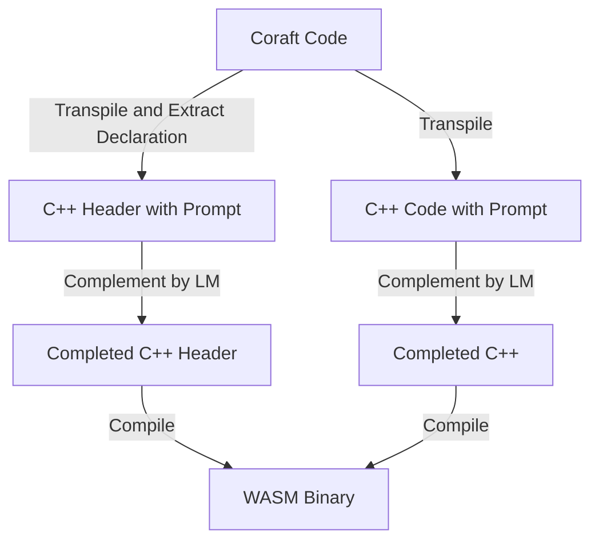
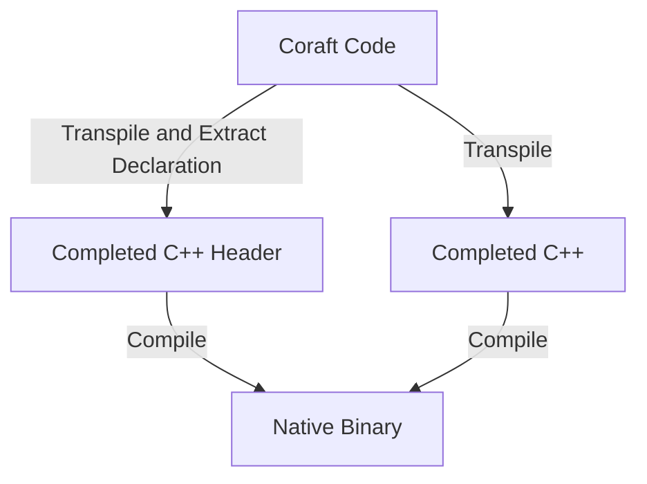

# Coraft
Coraft is meta-programming engine for C++, and its DSL, the name comes from "**co**de d**raft**" and "**co**-c**raft**".

This language resolves both the syntactic complexity of C++ and the hassle of vibe coding at once.

This is inspired by [ANPL](https://arxiv.org/abs/2305.18498) (by Di Huang et al., [repo](https://github.com/IPRC-DIP/ANPL)), [cppfront](https://github.com/hsutter/cppfront) (by Herb Sutter and contributors), and [Sugarcpp](https://github.com/curimit/SugarCpp)(by curimit and contributors)

## Motivation
We have two motivations.
### For Systems Programming
The systems programming ecosystem remains centered around C++, but writing C++ directly is notoriously painful.
Coraft provides a cleaner frontend for C++.

### For Vibe Coding
LM(Language Model)'s performance has improved dramatically in recent years, but it's still unreliable in the local inference.

ANPL was proposed when LMs were not yet reliable enough — a situation similar to today's local inference environment. Thus, we thus drew inspiration from it.

Furthermore, as long as there is demand for running inference on minimal hardware, reliability will always be a concern — regardless of how efficient LMs become.

## Compile Flow

### Compile Modes
Compile flow has two modes on Coraft one of these is "Easy Mode", inline-prompt for LMs are available in this mode, but run in a sandbox(e.g. WASM). The other one is "Turbo Mode", inline-prompt is disabled, but run on native.
#### Why Two Modes?
Certain tasks require OS access, yet trusting LM-generated code with such privileges is inherently risky.
Easy Mode resolves this tension by sandboxing the output; Turbo Mode foregoes LM involvement entirely for trusted, native execution.
#### Easy Mode


#### Turbo Mode

### Why Complement Code After Transpilation?

LM is better suited to handling existing languages ​​than to unknown new languages.

In the future, if this language will no longer be "unknown new languages" to LMs, we may revisit an ANPL-like recursive complementation.

## Sample Code

```Coraft
fn fizzbuzz(index i32) str
?{
	Write fizzbuzz function. 
}? // inline-prompt

fn main(args vector<str>) i32
{
	// # is annotation for AI
	var text str = ""; # string for printing.
	
	?{ Assign "Hello Coraft" to the variable `text`. }? // inline-prompt

	cout(<<, text, endl); // operator-chain, expanded to `cout << text << endl`

	for(var i = 0; i < 51; i++)
	?{
		output return value of `fizzbuzz(i)` to console. // This is in-prompt comment. LM can't read this.
	}?

	return 0;
}
```

## Components
 - Dace    - Coraft to C++ Transpiler
 - Opah    - LM Code Complementer
 - Hake    - Package Builder
 - Isaki   - Package Manager
 - Tilapia - LSP Server
 - Cor	   - Transpile Pipeline Driver
